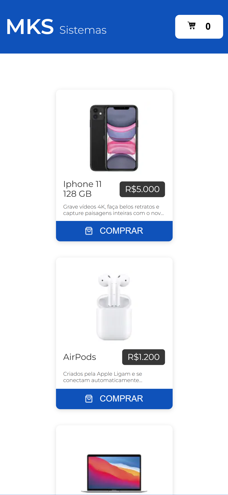
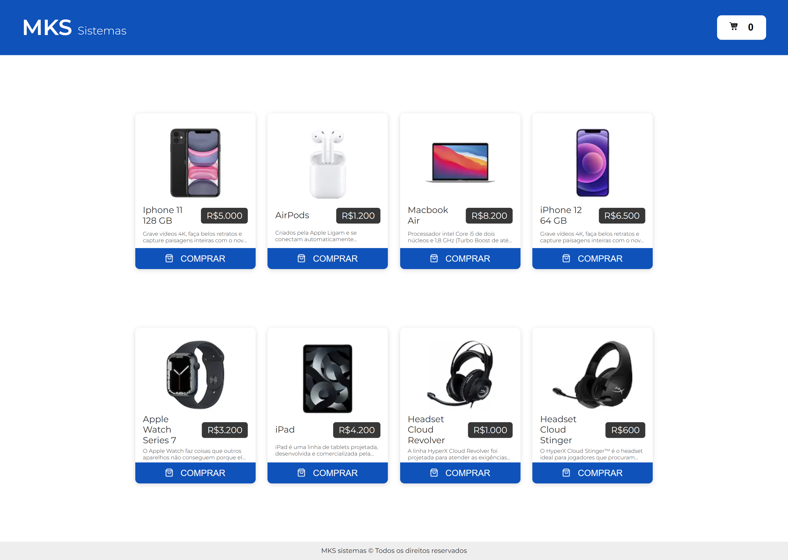

<h1 align="center"> MD Frontend Challenge </h1>

<p align="center">
This is a [Next.js](https://nextjs.org/) project bootstrapped with [`create-next-app`](https://github.com/vercel/next.js/tree/canary/packages/create-next-app). <br/>
</p>

<p align="center">
  <a href="#live">Live</a>&nbsp;&nbsp;&nbsp;|&nbsp;&nbsp;&nbsp;
  <a href="#GettingStarted">Getting Started</a>&nbsp;&nbsp;&nbsp;|&nbsp;&nbsp;&nbsp;
  <a href="#LearnMore">Learn More</a>&nbsp;&nbsp;&nbsp;|&nbsp;&nbsp;&nbsp;
  <a href="#DeployOnVercel">Deploy on Vercel</a>&nbsp;&nbsp;&nbsp;|&nbsp;&nbsp;&nbsp;
  <a href="#diretrizes">Diretrizes do desafio</a>&nbsp;&nbsp;&nbsp;|&nbsp;&nbsp;&nbsp;
</p>

<p align="center">
  
</p>

<br>

<table>
  <tbody>
    <tr>
      <td>
        
      </td>
      <td>
        
      </td>
    </tr>
  </tbody>
</table>

<h2 id="live">Live</h2>

This project is hosted at Vercel by the link <a href="https://mks-challenge.leonardojacomussi.com/" target="_blank">https://mks-challenge.leonardojacomussi.com/</a>

<h2 id="GettingStarted">Getting Started</h2>

First, install the dependencies:

```bash
npm i --force
```

Second, run the development server:

```bash
npm run dev
```

Open [http://localhost:3000](http://localhost:3000) with your browser to see the result.

You can start editing the page by modifying `pages/index.tsx`. The page auto-updates as you edit the file.

[API routes](https://nextjs.org/docs/api-routes/introduction) can be accessed on [http://localhost:3000/api/hello](http://localhost:3000/api/hello). This endpoint can be edited in `pages/api/hello.ts`.

The `pages/api` directory is mapped to `/api/*`. Files in this directory are treated as [API routes](https://nextjs.org/docs/api-routes/introduction) instead of React pages.

This project uses [`next/font`](https://nextjs.org/docs/basic-features/font-optimization) to automatically optimize and load Inter, a custom Google Font.

<h2 id="LearnMore">Learn More</h2>

To learn more about Next.js, take a look at the following resources:

- [Next.js Documentation](https://nextjs.org/docs) - learn about Next.js features and API.
- [Learn Next.js](https://nextjs.org/learn) - an interactive Next.js tutorial.

You can check out [the Next.js GitHub repository](https://github.com/vercel/next.js/) - your feedback and contributions are welcome!

<h2 id="DeployOnVercel">Deploy on Vercel</h2>

The easiest way to deploy your Next.js app is to use the [Vercel Platform](https://vercel.com/new?utm_medium=default-template&filter=next.js&utm_source=create-next-app&utm_campaign=create-next-app-readme) from the creators of Next.js.

Check out our [Next.js deployment documentation](https://nextjs.org/docs/deployment) for more details.

<h2 id="diretrizes">Diretrizes do desafio</h2>

O propósito primordial desta avaliação consiste em analisar sua proficiência na elaboração de código que seja claro, meticulosamente testado e passível de reutilização. Ao concluir a tarefa, solicitamos a gentileza de proceder com o deployment da aplicação e de nos fornecer, concomitantemente, os links correspondentes ao aplicativo e ao repositório associado. Este procedimento possibilitará uma análise abrangente do seu desempenho, sendo de suma importância para o desdobramento subsequente do processo avaliativo.

Tarefa (funcional)
---------------

Para esse desafio, você deve consumir nossa [API REST de produtos](https://mks-frontend-challenge-04811e8151e6.herokuapp.com/api-docs/) para exibir a lista de produtos da loja.

A aplicação deve conter apenas uma página/rota e um carrinho.

- <b>Loja</b>: A lista de produtos deve ser buscada de nossa API, use um shimmer/skeleton enquanto estiver em loading.

- <b>Carrinho</b>: O carrinho deve conter todos os produtos selecionados, juntamente com a opção de aumentar a quantidade de cada produto selecionado.

Use do Jest e a testing-library para realizar os testes unitários.

Recursos
---------------

UI/UX: [Figma loja](https://www.figma.com/file/ay9JKCd6LKvKLE7TclJJkX/MKS-Front-end-challenge?type=design&node-id=0%3A1&mode=design&t=AlZMI9zkOlhrx6JF-1) PS: O design system está incluso, incluindo a fonte.

API: [API REST de produtos](https://mks-frontend-challenge-04811e8151e6.herokuapp.com/api-docs/) para exibir a lista de produtos da loja.

Ferramentas requeridas
---------------

1. TypeScript
2. React ou Next.js (Preferimos Next.js)
3. React-query
4. Styled-components ou SASS
5. Framer-motion
6. Jest

Aspectos técnicos
---------------

Todas as ferramentas previamente elencadas são consideradas requisitos essenciais e, portanto, imprescindíveis para a realização deste projeto. Adicionalmente, sinta-se à vontade para empregar qualquer outra tecnologia que julgar pertinente e confortável para o desenvolvimento do mesmo. A flexibilidade para a utilização de recursos adicionais visa propiciar um ambiente propício à expressão de suas habilidades e à implementação de soluções que melhor se alinhem à sua abordagem e experiência.

Faça o deploy
---------------

Ao concluir o desenvolvimento, proceda com o deployment da aplicação no ambiente que lhe for mais conveniente, como por exemplo, AWS Amplify, Vercel, Netlify, Heroku, Amazon EC2, App Runner, entre outros. A escolha da plataforma de hospedagem fica a seu critério, sendo essencial assegurar que o aplicativo esteja acessível de maneira estável e eficaz para a avaliação subsequente.
